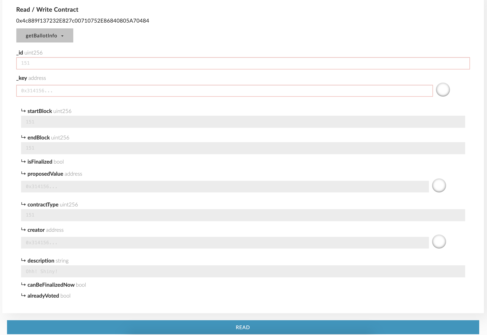

# Vote

Booli chain functionality can be change by voting on the contracts implementations. New implementations can be deployed, and opened to vote by validators for others to decide on whether to accept/reject the changes.

## Open a new ballot

In order to open a new vote, a validator needs to call the \`newBallot\` function on the [voting contract](https://booliscan.com/address/0x21639E5364dc91cB20b1D909FDeb4A3dfa7b4134) with the following params:

* startAfterNumberOfCycles - number of cycles \(minimum 1\) after which the ballot is open for voting
* cyclesDuration - number of cycles \(minimum 2\) for the ballot to remain open for voting
* contractType
  * 1 - Consensus
  * 2 - BlockReward
  * 3 - ProxyStorage
  * 4 - Voting
* proposedValue - address of the new implementation deployed for the relevant contract type
* description - text description which should contain the reason/change introduced in the ballot

## Check ballot info

Everyone can check all the ballots that were created using the \`getBallotInfo\` function. This function receives two params:

* id - the ballot id
* key - account address

## Vote

Everyone can vote on open ballots, after the start block has passed and until the end block hasn't yet.

It's important to note that at the end of a vote, only validators count towards the final result.

Voting is done by calling the \`vote\` function, which receives two params:

* id - the ballot id
* choice - 1 is accept, 2 is reject

Some other useful functions on the [voting contract](https://booliscan.com/address/0x21639E5364dc91cB20b1D909FDeb4A3dfa7b4134) are:

## getQuorumState

Returns the state of a specific ballot id: 1 - in progress, 2 - accepted, 3 - rejected

## getAccepted/getRejected

Returns the number of accepts/reject of a specific ballot id.

## activeBallots

Returns an array of active ballot ids.

